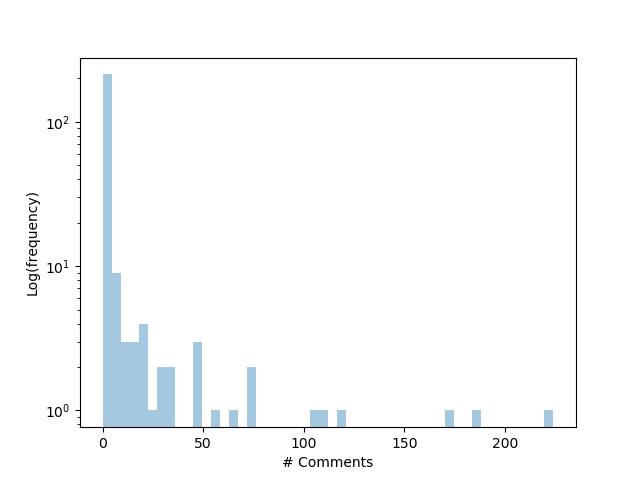
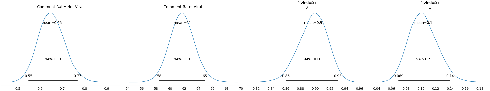

# Bayesian Comments Modeling

Social media comments are unruly; a few posts go viral (gaining lots of comments), and most gain very few comments. To model this phenomenon, this repository models comments using a mxiture of two poisson distributions - one distribution controlling the rate of comments for non-viral posts, and the other distribution controlling the rate of comments for viral posts.

This model is a personal exercise, mostly for practicing Poisson mixture models with PyMC3.

# Dataset

The dataset used is the distribution of comments on Hacker Rank posts. Some posts gain a large number of comments, while most gain very few comments.

# Model 

The model is a mixture of two poisson distributions: one controlling the comment rate for non-viral posts, and one controlling the comment rate for viral posts. As a bonus, the mixture parameter w estimates the proportion of viral posts. The wide divergence in rates between the two distributions supports the use of a mixture model.

# Parameter Estimates

